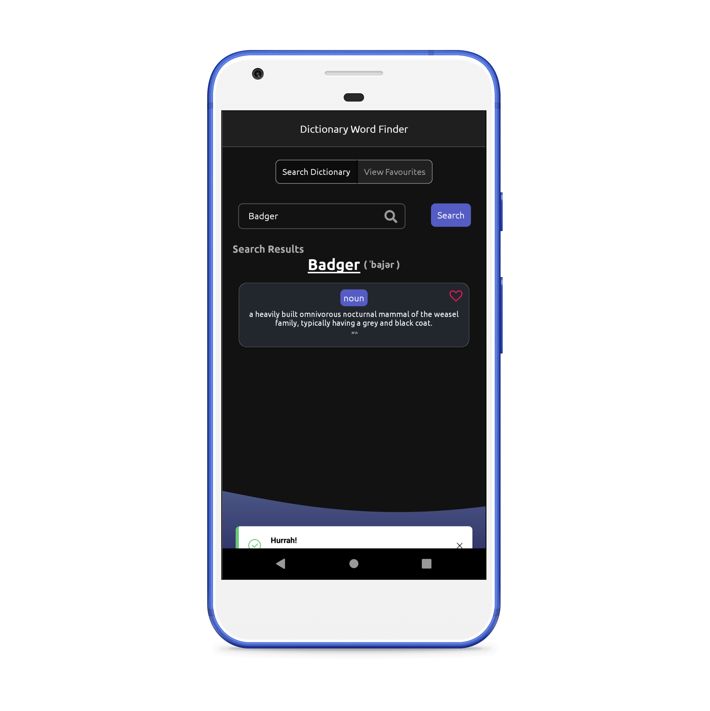

<h2 style="text-align:center">Dictionary Word Finder</h2>

#### Used Technologies 

- **React Native**
- **Typescript**
- **Axios**
- **Owl Bot API**
- **Async Storage**
- **Modular Component**
- **Composite Component**
- **Jest**
- **React Test Renderer**
- **git**

#### Development Environment

- **Linux (Ubuntu 20.04)**
- **NodeJs**
- **Android SDK**
- **Android Emulator**

#### Project Running commands

- Setup React Native Environment (Node, Java, Android SDK, React Native Cli) 
    - [Environment Setup Link](https://reactnative.dev/docs/environment-setup#development-os)

- `git clone https://github.com/absjabed/favourite-words.git`
- `cd /favourite-words`
- `yarn install`
- Start Android Emulator and check if it's available with `adb devices`
- `react-native start` (in separate terminal, if on Linux to start Metro Bundler)
- `react-native run-android`
    - if running fails `cd /android`
    - run `./gradlew clean` or for Windows `gradlew clean`
    - run `cd ..`
    - again run `react-native run-android`

- To run tests `yarn test`
    - if `snapshot` tests fails run `yarn test -u` to update and re-run `snapshot` tests

---

##### Build release apk
- `cd /favourite-words`
- `yarn install`
- `cd /android`
- `./gradlew clean` or for Windows `gradlew clean`
- `./gradlew assembleRelease` To release build apk.
- release apk file will be in `/favourite-words/android/app/build/outputs/apk/release/apk-release.apk`

    
##### Build release apk with Emulator Connected
- `cd /favourite-words`
- `yarn install`
- `cd /android`
- `./gradlew clean` or for Windows `gradlew clean`
- goto project root folder `cd ..`
- run `react-native run-android --variant=release` (if Emulator connected)
- release apk file will be in `/favourite-words/android/app/build/outputs/apk/release/apk-release.apk`
   
---

### [App-Video-Link](https://youtu.be/uTZxB6lVQ9w)

---

## App Screenshots (With usecases)
Left             |  Right
:-------------------------:|:-------------------------:
  |  |
 |    |
 | |
 | |
 |  |
 | |
